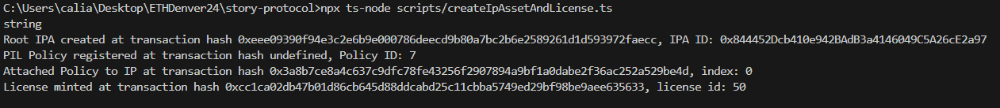

# Sponsor Prize

## Story Protocol

### Prize Requirements
**General track ($15K across 5 winners): Integrate Story Protocol in your dApp ($15K across 5 winners)
Memes ($2K)**

### Why we're applicable for this prize.
We leveraged Story Protocol for BeFit, and its MyFitness NFTs; users' fitness journey is registered as Programmable IP on the protocol, specifying a set of on-chain rights that dictate how their content can be used or built upon by others. This process will transform their MyFitness NFTs from static images (of users doing pushups) to dynamic, extensible assets capable of interacting and composing with other assets, effectively turning them into a networked, programmable part of the digital fitness ecosystem. By utilizing Story Protocol's data structures and modules, they can facilitate licensing, create new revenue streams through derivative works, and enhance the global accessibility and liquidity of their fitness IP, all while maintaining control and transparency over how it's used and remixed.

Note: There were issues with the .env variables and tutorial files not working, but we got it running!

### Link to the code where the tech is used.
https://github.com/WilliamUW/ETHDenver2024/blob/main/bounties/StoryProtocol.md

https://github.com/WilliamUW/ETHDenver2024/blob/main/story-protocol/scripts/MyFitness.sol

uri: ipfs://QmUtKFtF4DTkvabXnviyajTZR38ZTpHPk5NHYPTCy5joS2

contract deployment: https://sepolia.etherscan.io/tx/0xd6678d1d8d87a960d4ba3c485dab081ed13b22ade5c21ad0e93b5b7a862c3ba9

mint: https://sepolia.etherscan.io/tx/0xe3f73a6bb5875c60d98cc4b698f37866dca7785f55eefe9e79691b420e3fbf57

IP Asset and License

https://github.com/WilliamUW/ETHDenver2024/blob/main/story-protocol/scripts/createIpAssetAndLicense.ts

https://github.com/WilliamUW/ETHDenver2024/blob/main/story-protocol/scripts/mintNFT.ts

Explorer link: https://explorer.storyprotocol.xyz/ipa/0xccc99fcb118111e0927292a65d8f0e299934be28
